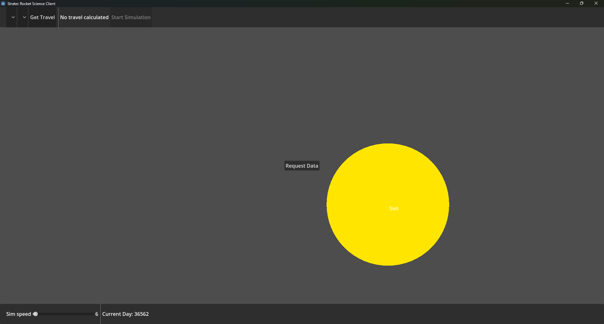
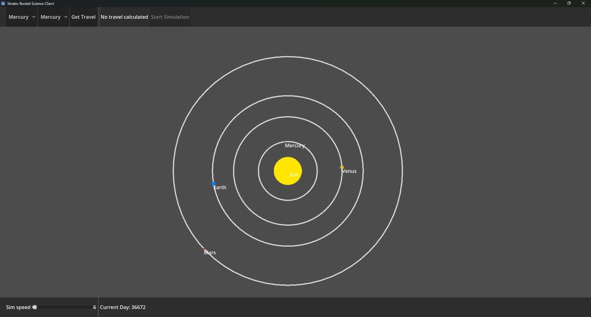
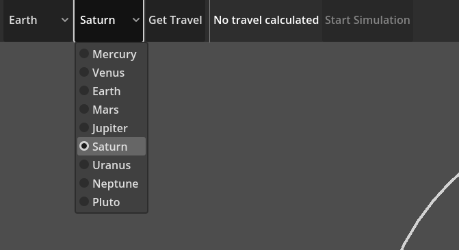
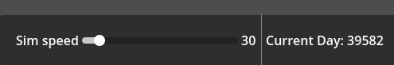
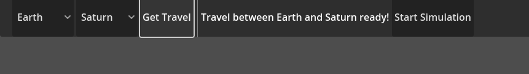
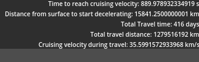
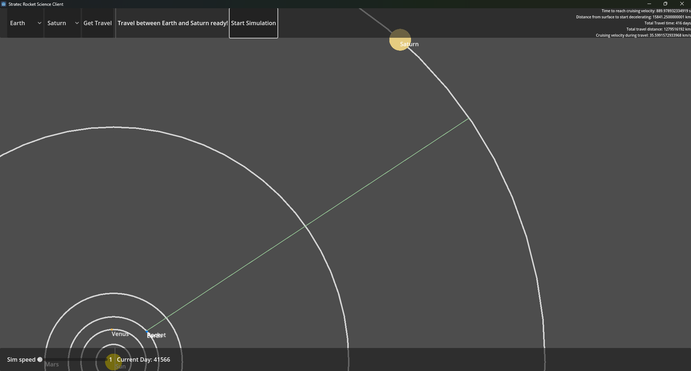
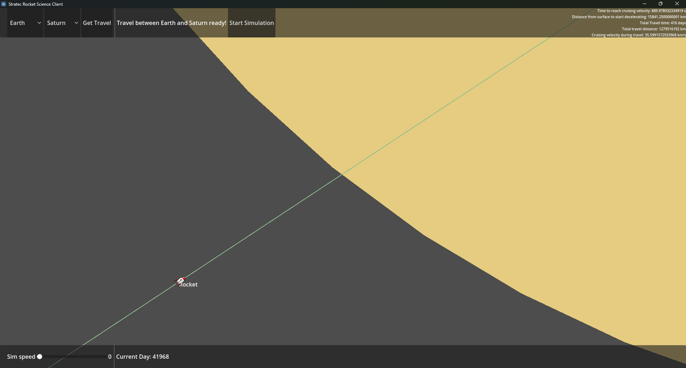

<!-- explain design choices
- why odin
- why godot

explain solution
- take each step into consideration
- why iterative solution for last part

explain gui
- why it looks inaccurate
- communication between apps

showcase
- pictures and examples -->

# Stratec Software Challenge 2025 Solution

> Usage: Start _backend.exe_ -> start _client.exe_ -> "Request Data" -> Have Fun
> 
> Binaries available on [GitHub](https://github.com/Tom3s/stratec-internship-software-challenge/releases/tag/rel)

---

This document serves as a walkthrough for the design process, choices and demo about my solution for this year's _Stratec Software Challenge_

## Tools used

> Backend - __Odin Lang__

For the main solutions and calculations of the simulation, I used _Odin Lang_, which is a manual memory managed language, with similar features as __C__, but with access to modern coding techniques and conventions. This allows for performant code (if used correctly), while still having a lot of built-in libraries at hand for more complex tasks

> GUI - __Godot Game Engine__

The choice of a game engine for the visual part is for easy and fast implementation of UI elements (buttons, sliders, etc.) as well as rendering (planets, camera controls, etc.). The lightweight nature of the engine allows for quick prototypization with decent results

> TCP Communication between Backend and Client

Having two different applications for this solution requires the transfer of data between them. For this I used a TCP connection, with _custom binary encoding_ for the necessary data

## Implementing the solution

Given all the equations and stages it was fairly trivial to implement a working solution. I took expandability into consideration while implementing every stage, which allowed me to build on the previous stages' solutions. I tried to keep every calculation as a direct evaluation and refrained myself from plugging in calculation values for equations, in order to get more accurate results.

---

> Stage 3 - Freezing the solar system at the start of the travel

Since checking for planet collisions was as simple as making a "_line intersects circle_" check, getting a _local optimum_ solutions was as easy as optimizing for travel distance (easily checked with a closed form solution)

> Stage 4 - Planets keep moving

- Remark: since there was no mention if the target planet would still freeze or not, I opted to solve for a moving target planet as well (more accurate simulation)

- Remark: I tried solving the target planets location in the future, depending on the travel time and cruise velocity, but did not arrive at a closed for solution, so I opted for an iterative one

The solution was to check for a given time-frame, if the rocket would collide with the planet in __X__ days of travel (estimate of how far long the travel is) and only accept solutions, where the difference is _lower_ than the target planet's radius (this means the rocket enters the target planet's gravity well, and can land on it)

- Remark: we don't have to check a whole bunch of arbitrary travel time lengths, since we can calculate the minimum and maximum travel lengths (min: planets are aligned; max: planets are aligned in opposite orbits)

This optimization yielded an acceptable solution, even when checking in the whole _10 year limit_ timeframe

```odin
for i in min_time.days..=max_time.days {
	...
	dist := get_complex_distance_between(p1, p2, start_day, i) - cast(f64) p1.diameter * 0.5 - cast(f64) p2.diameter * 0.5;
	seconds := cast(f64) i * 24 * 60 * 60;

	dist_covered := seconds * cruising_vel;

	if min_travel_dist > dist && abs(dist - dist_covered) < min(cast(f64) p1.diameter * 0.5, cast(f64) p2.diameter * 0.5){
		if !verify_complex_travel(
			p1, p2,
			planets,
			start_day, i,
			cruising_vel,
		) {
			continue;
		}

		// save solution if better
	}
}
```
> - the `get_complex_distance_between(..)` function returns the distance that needs to be traveled in a given time-frame (taking into account the movement of the planet)
> - with `abs(dist - dist_covered) < min(cast(f64) p1.diameter * 0.5, cast(f64) p2.diameter * 0.5)` I check if the rocket hits the target planet's _orbit radius_ with maximum error of the smaller planet's radius (to ensure entering its gravity well)

```odin
verify_complex_travel :: proc(p1, p2: Planet, planets: [dynamic]Planet, start_day, travel_days: i32, vel: f64) -> bool {
	p1_pos := get_planet_position(p1, start_day);
	p2_pos := get_planet_position(p2, start_day + travel_days);

	closer_planet: f64 = min(p1.orbital_radius, p2.orbital_radius);
	farther_planet: f64 = max(p1.orbital_radius, p2.orbital_radius);

	for planet in planets {
		if planet.orbital_radius > closer_planet && planet.orbital_radius < farther_planet {
			orbit_radius := linalg.length(get_planet_position(planet, 0));
			collision_day := make_time(orbit_radius / vel);

			if line_intersects_circle(
				p1_pos, p2_pos, 
				get_planet_position(planet, collision_day.days),
				cast(f64) planet.diameter * .5,
			) {
				return false;
			}
		}
	}

	return true;
}
```

> - for checking if we collide with other planets, it's sufficient to check if we collide with it on the day we cross its orbit radius
> - the day of crossing the orbit radius can be calculated from the _cruise velocity_ and the _orbital radius_ itself `collision_day := make_time(orbit_radius / vel)`

With all this in place, we can find a _local optimal_ solution (in the time-frame of the given _10 years_)

## Graphical Interface

The interface implemented in _Godot_ comes with a visualisation of:
- the planets
- the orbits
- camera controls
- option to request a travel between 2 selected planets
- to run the travel simulation

> Remark: some travel simulations may look innacurate (giving travels with visual collision between the rocket and non-target planets), which is the result of scaled up visuals, as the accurate viusals result in very miniscule planets in our massive solar system

In order for the GUI application to get data from the simulation app itself, a TCP communication is used

After starting the client, the user can request the _Solar System Data_ from the backend, and after that the planets will be displayed, and start moving. The passing of time (how fast the solar system progresses through days) can be adjusted

The user can also select 2 planets, from and to which they can request an optimal travel. After the client receives this travel data, the user can start the simulation any time and as many times as they like, as long as that travel is the last they requested

## Showcase


> The client startup screen


> Displaying and simulating the solar system after receiving the data about it


> How the user can set desired travel parameters


> Control and info about current simulation speed


> Confirmation of a travel after being received by the client


> All the relevant information about the travel (upper right corner)


> Visual representation of a travel currently being simulated


> The rocket a few days before arriving to the target planet

## Future Development

Since this was a quick project, it still has some issues that need to be ironed out

> Better user experience

- currently the app requires a restart of the client and the backend to work properly

> Toggle for higher accuracy

- There could be a toggle to enable _to-scale_ rendering, if the user desires so

> Better time control

- an option to go back in time, or to jump to any day of the simulation would enhance experience

> Accurate simulation

- current the rocket's travel is just approximated, as the timestep (days/second) is not accurate enough to correctly simulate the rocket's travle (ie. accel/decel takes couple hundred seconds only, which is just a small fraction of the timestep)
- _Note:_ in the backend, the travel is accurately calculated, but it's unneccessary to display that visually

> Visual Polish

- adding planet textures (or even shaders for _visual eye candy_) and a starry background that has a _parallax_ effect (for which I gave a go, but couldn't implement it in a reasonable time, so I scratched the idea) could enhance the visuals

## Conclusion

This project was a fun one to implement and play around with. The Stages were pretty well balanced, to get to a solution step by step. 

It would be fun to have a version where the _gravity wells_ affect the rocket's travel, and so you could use those redirects to have a non-straight path

